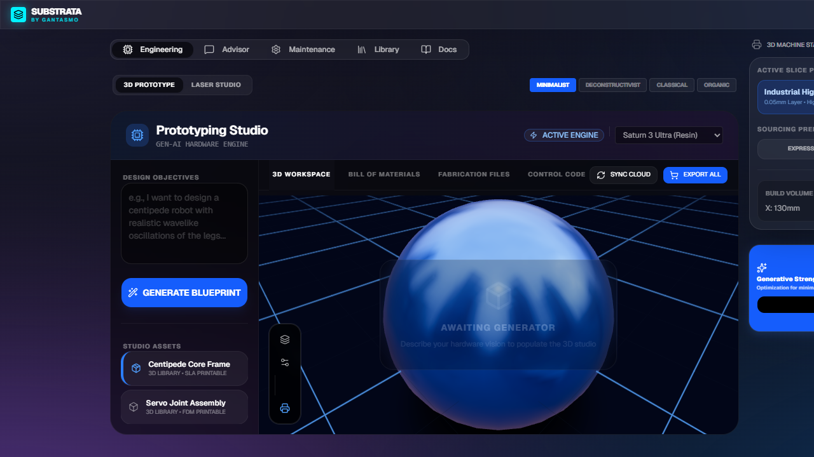
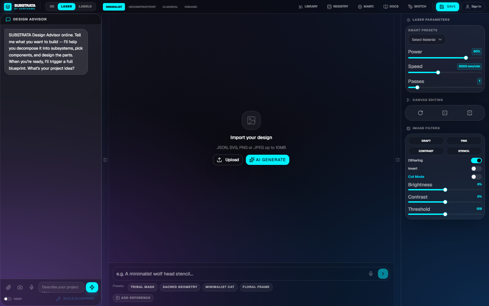
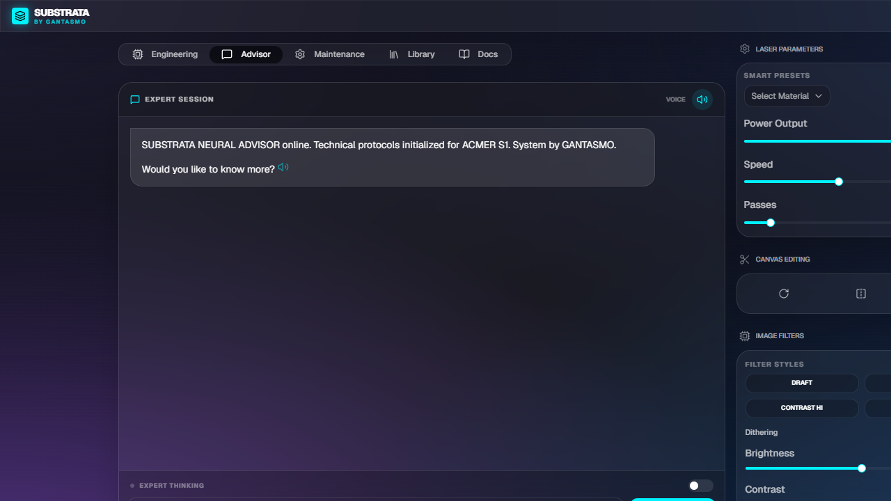
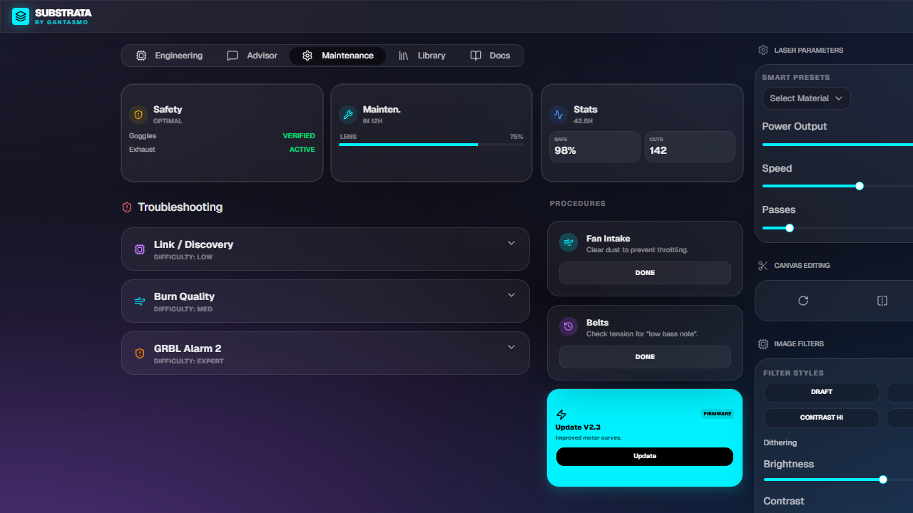
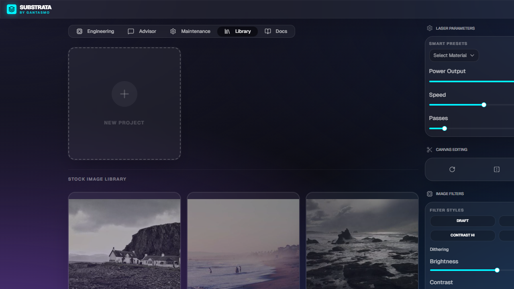

<div align="center">

# SUBSTRATA *by* GANTASMO

**AI-Powered Rapid Prototyping Suite**

*Ideate · Design · Fabricate · Engrave · Ship*


</div>

---

## Overview

SUBSTRATA is a full-stack rapid prototyping suite that takes your idea from concept to physical object. It combines AI-powered design generation, 2D/3D modeling, image processing, fabrication planning, laser engraving, and cloud project management into one end-to-end pipeline.

Whether you're designing a hexapod robot, a custom PCB enclosure, an LED doorknob, or a kinetic sculpture, SUBSTRATA handles every stage — from brainstorming with an AI advisor, through component sourcing and real design file generation (OpenSCAD, SVG, wiring diagrams), to fabrication-ready output.

The **persistent AI Design Advisor** sits in the corner of every screen, ready to decompose your idea into subsystems, reference a built-in database of 30+ real components and 12 design templates, apply best design practices for 3D printing and laser cutting, and — when you're ready — trigger full blueprint generation with a single click.

### Screenshots

| Prototyping Studio | Design Studio | AI Advisor |
|---|---|---|
|  |  |  |

| Maintenance Dashboard | Project Library |
|---|---|
|  |  |

---

## The Prototyping Pipeline

SUBSTRATA structures every project as a pipeline with these stages:

```
 IDEATE ──→ DESIGN ──→ PROCESS ──→ FABRICATE ──→ FINISH
   │           │          │            │            │
   │   AI Design     Image proc   3D print    Laser engrave
   │   Advisor        dithering    SLA/FDM     marking/cutting
   │   (persistent)   edge detect  OpenSCAD    material presets
   │   Component DB   filters      SVG parts   export to G-code
   │   Template DB    canvas edit  Wiring      PNG/SVG output
   │   Design         AI inpaint   Assembly    Community refs
   │   Practices      outpaint     steps
   └── Browse GitHub, Thingiverse, Instructables, Hackaday, GrabCAD
```

---

## Features

### 🧊 3D Prototyping Studio
- **AI Blueprint Generation**: Describe any hardware project — Gemini Pro with deep thinking generates a complete blueprint with real design files, BOM, assembly instructions, and control code
- **OpenSCAD Code Generation**: Parametric 3D part definitions — real `.scad` files you can render, modify, and print
- **SVG Laser-Cut Layouts**: Vector paths for flat parts, mounting plates, structural members — ready for LaserGRBL/LightBurn
- **Wiring Diagrams**: Pin-by-pin connection tables for microcontrollers, sensors, and actuators
- **Assembly Steps**: Numbered step-by-step build instructions generated from the design
- **Interactive 3D Viewer**: Three.js viewport with orbit controls, multi-light staging
- **Bill of Materials**: Auto-generated parts list with pricing from Amazon, McMaster-Carr, Pololu, Adafruit, Grainger — sortable by price or shipping speed
- **Design Notes & Community References**: AI-generated design rationale plus links to relevant open-source projects
- **Component Database Injection**: 30+ real components (servos, MCUs, sensors, LEDs, power supplies) with specs and prices injected into AI context
- **Template Library**: 12 project archetypes (hexapod, quadruped, robotic arm, wheeled rover, LED doorknob, weather station, macro keypad, kinetic sculpture, voronoi lamp, gear clock, drone frame, plant monitor) with subsystem breakdowns

### 🎨 Design Studio
- **AI Design Generation**: Text and voice prompts via Gemini Flash Image — supports 4 design styles (minimalist, deconstructivist, classical, organic)
- **Image Processing Pipeline**: Grayscale conversion, Floyd-Steinberg dithering, Sobel edge detection, brightness/contrast/threshold
- **Template Library**: Pre-built design templates across categories
- **Canvas Transforms**: Rotate (90° increments), flip horizontal/vertical
- **Export**: PNG raster and SVG vector formats

### 🖌️ Advanced Editor (Design Synth)
- **Konva Canvas**: Selection, box draw, eraser brush, text overlay tools
- **AI Inpainting**: Fill masked regions with AI-generated content
- **AI Outpainting**: Extend images beyond their boundaries
- **Style Transfer**: Restyle entire images with a text prompt

### 🔧 Laser Fabrication
- **Smart Material Presets**: 9 pre-configured profiles (Kraft paper, Plywood, Wood, Bamboo, Cork, Leather, Silica gel, Felt, Tin plate)
- **Power/Speed/Passes Control**: Fine-tuned parameters for the ACMER S1 diode laser
- **LaserGRBL/LightBurn Export**: SVG vector output for CNC laser software

### 🤖 AI Design Advisor (Persistent)
- **Always Available**: Floating panel in the bottom-right corner of every screen — never buried in a tab
- **Design Decomposition**: Breaks your idea into subsystems, identifies key components, suggests fabrication methods
- **Component Database**: References 30+ real components (SG90 servos, ESP32, Arduino Nano, MPU6050, WS2812B LEDs, etc.) with specs and prices
- **Design Practices Library**: Built-in DFM rules for 3D printing, laser cutting, electronics layout, and mechanical design
- **Blueprint Trigger**: When your idea is ready, the advisor calls `generate_blueprint` to auto-switch to the Prototyping Studio and kick off full generation
- **"Build Blueprint from Discussion" Button**: Manual trigger to compile your conversation into a blueprint prompt
- **Deep Thinking Mode**: Complex query analysis via Gemini Pro with high-level reasoning
- **Voice I/O**: Voice prompts and TTS responses (5 voice options)
- **Tool Use**: Can save material presets and trigger blueprint generation directly from conversation
- **Google Search Grounding**: Real-time information retrieval

### 🌐 Community Inspiration & Reference Databases
- **GitHub**: Search and browse open-source hardware projects, reference designs, and firmware
- **Thingiverse**: Discover 3D-printable models and remixable designs
- **Instructables**: Step-by-step project guides and build tutorials
- **Hackaday**: Hardware hacking projects, teardowns, and engineering write-ups
- **GrabCAD**: Professional CAD models and engineering references
- **Adafruit Learn**: Electronics tutorials and component guides
- **Auto-Injected Context**: Community sources are automatically referenced in AI advisor and blueprint generation prompts

### 🔒 Machine Maintenance
- Safety status monitoring (goggles, exhaust)
- Lens cleanliness tracking and maintenance scheduling
- Operational statistics and troubleshooting guides

### 📁 Project Library
- Google Auth with cloud storage via Firestore
- Save/Load/Rename/Duplicate/Share/Delete projects
- Curated stock templates across categories

### 📖 In-App Documentation
- Searchable documentation accessible from the **Docs** tab
- Design guides, best practices, and material reference tables
- Export as HTML or PDF

---

## Architecture

```
┌──────────────────────────────────────────────────────────┐
│                 Browser Client (React)                    │
│                                                          │
│   App.tsx ─── PrototypingStudio ─── AdvancedEditor       │
│      │              │                                    │
│      │        designDatabase.ts                          │
│      │        (templates · components · practices)        │
│      │                                                   │
│   ┌──┴────────────────────────────────────────────────┐  │
│   │              Service Layer                         │  │
│   │  geminiService · ttsService · projectService       │  │
│   │  (blueprint gen · advisor · design file output)    │  │
│   └──┬────────────────────────────────────────────────┘  │
│      │                                                   │
│   ┌──┴────────────────────────────────────────────────┐  │
│   │              Library Layer                         │  │
│   │  imageProcessor · firebase · constants             │  │
│   └──────────────────────────────────────────────────┘   │
│                                                          │
│   ┌─────────────────────────────────────────────────┐    │
│   │  Persistent Advisor Panel (floating, bottom-right)│   │
│   │  → triggers blueprint gen via tool call           │   │
│   └─────────────────────────────────────────────────┘    │
└──────────────┬──────────────┬──────────────┬─────────────┘
               │              │              │
          Gemini API    Firebase       Three.js
               │
    ┌──────────┴──────────────┐
    │  Community APIs          │
    │  GitHub · Thingiverse    │
    │  Instructables · Hackaday│
    │  GrabCAD · Adafruit Learn│
    └─────────────────────────┘
```

### Technology Stack

| Layer | Technology |
|-------|-----------|
| **Framework** | React 19 + TypeScript 5.8 |
| **Build** | Vite 6.2 |
| **Styling** | Tailwind CSS 4.1 (glassmorphism theme) |
| **UI Components** | shadcn/ui (Radix + CVA) |
| **3D Engine** | Three.js (React Three Fiber + Drei) |
| **Canvas Editor** | Konva + react-konva |
| **AI** | Google Gemini API (Pro, Flash, Flash Image, Flash TTS) |
| **Auth & DB** | Firebase (Google Auth + Firestore) |
| **Animation** | Motion (Framer Motion) |
| **Icons** | Lucide React |

### Key AI Models

| Model | Usage |
|-------|-------|
| `gemini-3.1-flash-image-preview` | Design generation, AI canvas synthesis (inpaint/outpaint/style) |
| `gemini-3.1-pro-preview` | Blueprint generation, material analysis, expert advisor (deep thinking) |
| `gemini-3-flash-preview` | Chat advisor, audio transcription |
| `gemini-3.1-flash-tts-preview` | Text-to-speech |

---

## Getting Started

### Prerequisites
- Node.js 18+
- Google Gemini API Key
- Firebase project with Auth + Firestore enabled

### Installation

```bash
# Clone the repository
git clone https://github.com/danieljtrujillo/substrata-by-gantasmo.git
cd substrata-by-gantasmo

# Install dependencies
npm install

# Configure environment variables
cp .env.example .env
# Edit .env with your API keys and Firebase config

# Start development server
npm run dev
```

The app runs at `http://localhost:3000`.

### Environment Variables

```env
GEMINI_API_KEY=your_gemini_api_key
VITE_FIREBASE_API_KEY=your_firebase_api_key
VITE_FIREBASE_AUTH_DOMAIN=your-project.firebaseapp.com
VITE_FIREBASE_PROJECT_ID=your-project-id
VITE_FIREBASE_STORAGE_BUCKET=your-project.appspot.com
VITE_FIREBASE_MESSAGING_SENDER_ID=123456789
VITE_FIREBASE_APP_ID=your-app-id
VITE_FIREBASE_FIRESTORE_DB_ID=your-db-id
```

### Commands

| Command | Description |
|---------|-------------|
| `npm run dev` | Development server (port 3000) |
| `npm run build` | Production build |
| `npm run preview` | Preview production build |
| `npm run clean` | Remove dist/ |
| `npm run lint` | TypeScript type checking |

---

## Project Structure

```
src/
├── App.tsx                      # Main application + persistent advisor panel
├── main.tsx                     # React entry point
├── index.css                    # Global styles + glassmorphism theme
├── constants.ts                 # Material presets & project templates
├── designDatabase.ts            # Component DB, design templates, DFM practices
├── components/
│   ├── PrototypingStudio.tsx    # 3D AI prototyping engine (OpenSCAD/SVG/wiring)
│   ├── AdvancedEditor.tsx       # Konva canvas editor
│   └── DocumentationViewer.tsx  # In-app docs with export
├── docs/
│   └── documentationContent.ts  # Documentation data
├── services/
│   ├── geminiService.ts         # Gemini API wrapper + blueprint generation
│   ├── ttsService.ts            # Text-to-speech
│   └── projectService.ts       # Firestore CRUD
└── lib/
    ├── firebase.ts              # Firebase init + auth
    └── imageProcessor.ts        # Image processing pipeline
```

---

## Security

- **Authentication**: Firebase Google Sign-In with email verification
- **Data Isolation**: All data sandboxed under `/users/{uid}/`
- **Firestore Rules**: Hardened with schema validation, immutability constraints, 1MB image limits
- **Global Deny**: Catch-all rule blocks all access by default; specific paths whitelisted
- **Security Testing**: 12 attack vectors ("Dirty Dozen") verified — see [security_spec.md](security_spec.md)
- **API Keys**: Injected at build time via Vite, never committed to source

---

## Documentation

Full documentation is available in three ways:

1. **In-App**: Click the **Docs** tab in the navigation bar
2. **HTML Export**: From the Docs tab, click **HTML** to download an interactive offline reference
3. **PDF Export**: From the Docs tab, click **PDF** to generate a print-ready document

Documentation covers: Overview, Prototyping Pipeline, Design Guides & Best Practices, Feature Reference, API Reference, Community Sources, Security, and Setup.

---

## License

SPDX-License-Identifier: Apache-2.0
