<div align="center">

# SUBSTRATA
### *by*
# GANTASMO

**The open-source command center for rogue engineers, garage-lab inventors, and anyone who thinks "buy it off the shelf" is a moral failing.**

*Ideate · Design · Fabricate · Engrave · Label · Ship*


</div>

---

## Overview

SUBSTRATA is the full-stack prototyping war room you build when you're sick of duct-taping twelve browser tabs together. AI image generation, parametric 3D modeling, laser G-code pipelines, real-time material analysis, wiring diagrams, and firmware scaffolding all live in one dark-mode glassmorphism cockpit that runs on caffeine and Gemini 3.1.

Point it at a napkin sketch or scream "hexapod robot" into your mic. The AI advisor decomposes it into subsystems, pulls from a built-in database of 30+ real components and 50+ battle-tested design templates, applies DFM rules for your printer and laser, and (when you give the word) generates OpenSCAD, SVG cut files, and pin-by-pin wiring in one shot. Then you hit print.

The **persistent AI Design Advisor** sits in the left panel of every screen. Co-pilot, enabler, mad-scientist hype man. It knows your components, your constraints, and community projects across GitHub, Thingiverse, Hackaday, and Instructables. Give it an idea and it starts building.

---

## Studio Modes

SUBSTRATA pivots its entire toolset around one of three studio modes (toggle in the top header — persists in localStorage as `substrata.studioMode`):

| Mode | Focus | Specialty Output |
|------|-------|-----------------|
| 🛠️ **Maker** | 3D printable parts, assemblies, hardware projects | OpenSCAD parts · STL/GLB · Wiring · BOM · Firmware |
| 🏛️ **Architecture** | Buildings, fixtures, code-compliant structures | Floor plans · Electrical plans · IBC/ADA/NEC reports · Layered DXF |
| ⚡ **Hacker** | PCBs, embedded systems, deep electronics | KiCad `.kicad_sch` · Schematic IR · Net validation · Footprints |

Each mode swaps in mode-specific generation paths, validation rules, and right-rail panels while sharing the same unified viewport, advisor, and library.

<div align="center">
<table>
<tr>
<td align="center"><b>Maker (default)</b></td>
<td align="center"><b>Architecture</b></td>
<td align="center"><b>Hacker</b></td>
</tr>
<tr>
<td>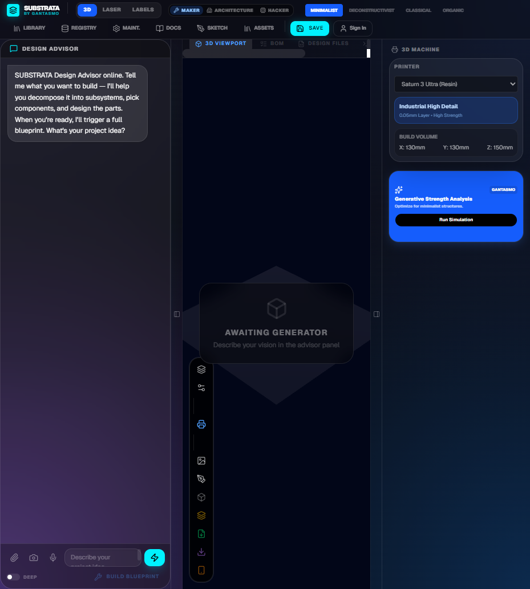</td>
<td></td>
<td></td>
</tr>
</table>
</div>

---

## Screenshots

### Core Workspaces

<table>
<tr>
<td align="center"><b>3D Prototyping Studio</b></td>
<td align="center"><b>Laser Engraving Studio</b></td>
<td align="center"><b>Label & Sticker Studio</b></td>
</tr>
<tr>
<td></td>
<td></td>
<td>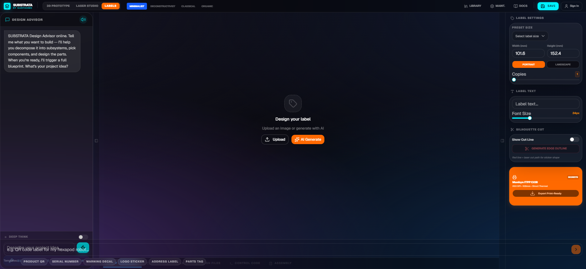</td>
</tr>
</table>

### AI Advisor & Output Tabs

<table>
<tr>
<td align="center"><b>Design Advisor Panel</b></td>
<td align="center"><b>BOM Tab</b></td>
<td align="center"><b>Design Files Tab</b></td>
</tr>
<tr>
<td></td>
<td></td>
<td></td>
</tr>
</table>

<table>
<tr>
<td align="center"><b>Code Tab</b></td>
<td align="center"><b>Assembly Tab</b></td>
<td align="center"><b>Design Styles</b></td>
</tr>
<tr>
<td>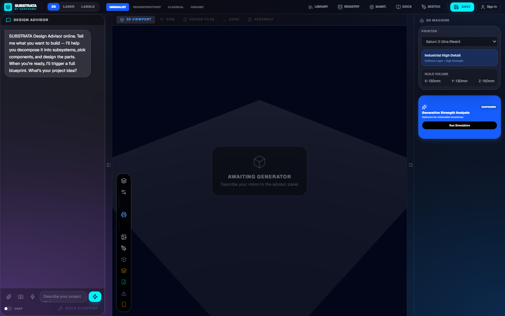</td>
<td></td>
<td>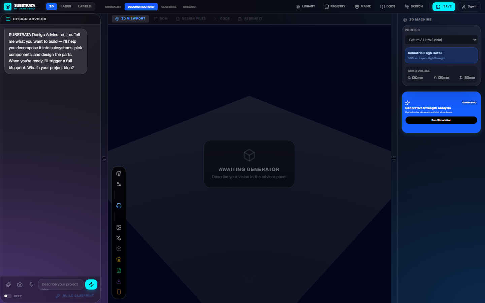</td>
</tr>
</table>

### Tools & Modals

<table>
<tr>
<td align="center"><b>Project Library</b></td>
<td align="center"><b>Documentation</b></td>
<td align="center"><b>Machine Maintenance</b></td>
</tr>
<tr>
<td>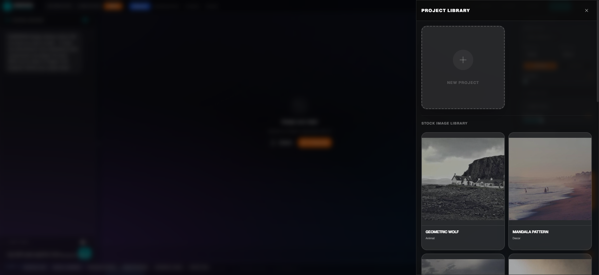</td>
<td>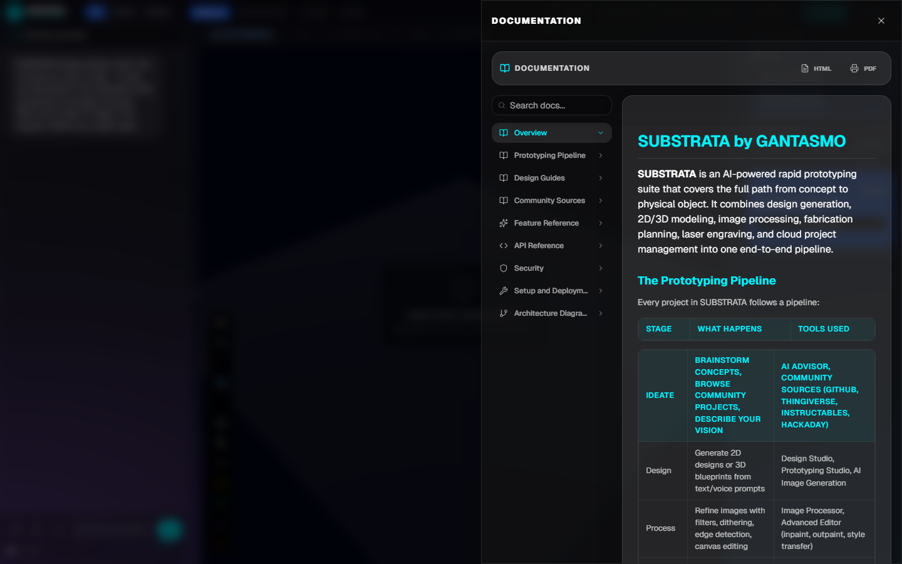</td>
<td>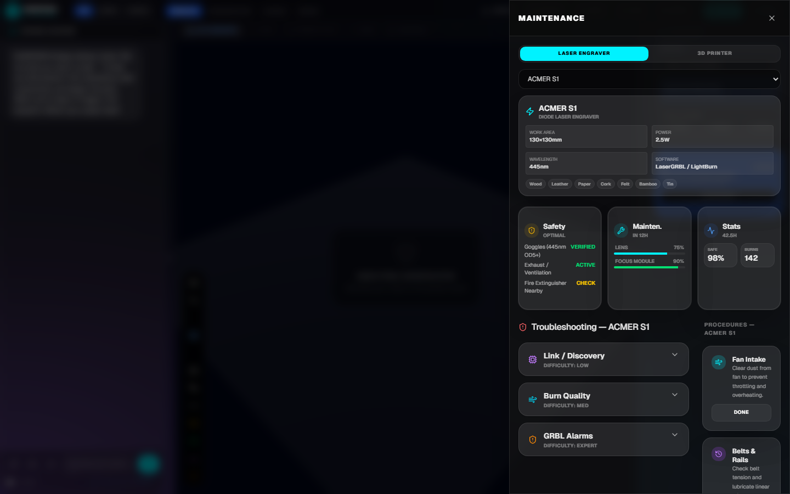</td>
</tr>
</table>

<table>
<tr>
<td align="center"><b>Component Registry</b></td>
<td align="center"><b>Concept Sketch Panel</b></td>
</tr>
<tr>
<td>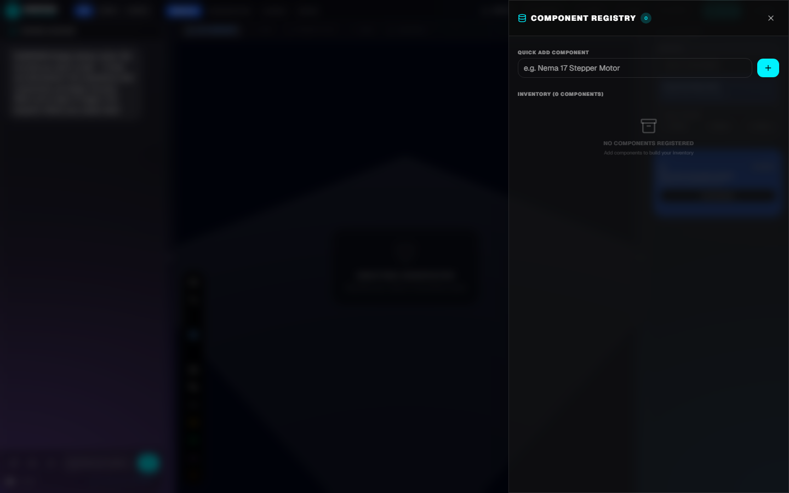</td>
<td>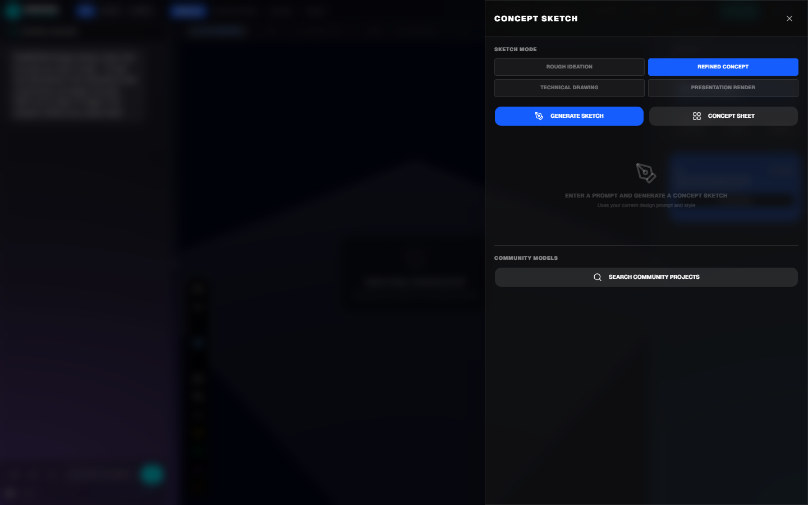</td>
</tr>
</table>

---

## The Prototyping Pipeline

SUBSTRATA structures every project as a pipeline with these stages:

```
 IDEATE ──→ DESIGN ──→ PROCESS ──→ FABRICATE ──→ LABEL ──→ FINISH
   │           │          │            │            │          │
   │   AI Design     Image proc   3D print    Label design  Laser engrave
   │   Advisor        dithering    SLA/FDM    Sticker/decal  marking/cutting
   │   (persistent)   edge detect  OpenSCAD   Munbyn print   material presets
   │   Component DB   filters      SVG parts  Edge silhouette G-code export
   │   Template DB    canvas edit  Wiring     Cut line SVG    PNG/SVG output
   │   Design         AI inpaint   Assembly   AI generation   Community refs
   │   Practices      outpaint     firmware   displacement    2D→3D mesh
   │                  style xfer   estimates   mesh relief
   └── Browse GitHub, Thingiverse, Instructables, Hackaday, GrabCAD
```

---

## Features

### 3D Prototyping Studio

The central engineering workspace. Describe any hardware project and Gemini Pro generates a complete blueprint.

- **Blueprint generation** — 8-stage AI pipeline produces OpenSCAD parts, SVG cut files, wiring diagrams, BOM, firmware, and assembly steps from a text description
- **Three.js 3D viewport** — Real-time rendering with orbit controls, multi-light staging, grid, shadow rendering, part selection and highlighting, wireframe overlay
- **Viewport header tab bar** — Switch between 3D Viewport, BOM, Design Files, Code, and Assembly; non-3D tabs fill the full viewport as an overlay
- **Inline fabrication estimates** — Real-time polygon count, print time (resin vs FDM), and laser cut time shown in the tab bar, derived from the selected machine's specs
- **Parametric OpenSCAD** — Module-based geometry with CSG operations (difference, union, intersection, hull), parametric dimensions, assembly positioning, and tolerance specs
- **SVG laser-cut layouts** — Multi-part vector files separated by `<!--PART_BREAK-->` markers, ready for LaserGRBL / LightBurn
- **Pin-by-pin wiring diagrams** — Mermaid flowcharts + text connection tables for microcontrollers, sensors, and actuators
- **Firmware scaffolding** — Compilable Arduino and MicroPython code generated per-project
- **Numbered assembly steps** — Step-by-step build instructions with part callouts
- **BOM with vendor links** — Auto-generated parts list with prices from Amazon, McMaster-Carr, Pololu, Adafruit, and Grainger; sortable by cost or fastest delivery; select-all, copy, per-item checkboxes
- **Parametric variant generator** — Modify existing OpenSCAD code with a text prompt to produce design variations
- **Community model search** — Scan Thingiverse, Printables, GrabCAD, GitHub, Instructables, Hackaday, and MyMiniFactory for related open-source projects
- **30+ real components** — SG90 servos, ESP32, Arduino Nano, MPU6050, WS2812B LEDs, stepper motors, buck converters, etc., with specs and prices injected into AI context
- **50+ project templates** — Hexapod, quadruped, robotic arm, wheeled rover, LED doorknob, weather station, macro keypad, kinetic sculpture, voronoi lamp, gear clock, drone frame, plant monitor, Stewart platform, delta printer, open-source prosthetic hand, and more

#### 3D Viewport Toolbar

| Button | Function |
|--------|----------|
| Layers | Toggle scene layer visibility |
| Settings | Viewport rendering options |
| Printer | Show build volume overlay for selected printer |
| Reference Image | Load a design reference photo |
| Sketch Pad | Open the concept sketch panel |
| Profile Extrude | Extract 2D silhouette from image → OpenSCAD `linear_extrude` |
| Displacement Mesh | Generate depth-based 3D relief from image brightness (2D→3D) |
| Export STL | Download ASCII STL for slicing |
| Export GLB | Download GLTF binary for AR/web |
| AR Viewer | View model in augmented reality on mobile |

### 2D-to-3D Image Conversion

Two methods to turn a flat image into a 3D object directly in the browser:

- **Profile Extrusion** — Extracts the outer boundary of an image silhouette, simplifies the point cloud, and generates an OpenSCAD `linear_extrude(polygon(...))`. Good for logos, icons, and clean-edged shapes.
- **Displacement Mesh** — Treats image brightness as a heightmap and generates a subdivided polyhedron mesh (similar to Blender's Displace modifier on a subdivided plane). Configurable resolution (8–80 grid), scale, max height, depth inversion, and Z-mirror for double-sided relief. Outputs OpenSCAD `polyhedron()` code.

### Laser Engraving & Cutting Studio

Canvas-based image processing pipeline optimized for diode and CO2 laser output.

- **Image processing pipeline** — Brightness, contrast, threshold, Floyd-Steinberg dithering, invert, Sobel edge detection, rotation (0/90/180/270°), flip H/V
- **9 material presets** — Kraft paper, plywood, solid wood, bamboo, cork, leather, silica gel, dark felt, tin plate — each with power/speed/passes tuned for the ACMER S1
- **Smart settings** — AI analyzes a photo of your material and recommends optimal laser parameters
- **Material analysis** — Upload a material photo; Gemini identifies the material type and suggests settings from the ACMER S1 manual
- **Canvas editing** — Drawing brush, eraser, selection box, text overlay with size control
- **AI design generation** — Text-to-image via Gemini Flash Image with 4 design styles and 3 aspect ratios (1:1, 16:9, 9:16)
- **Reference image system** — Upload design inspiration photos for AI context
- **Export** — Raster PNG at native resolution, SVG vector wrapper for LaserGRBL/LightBurn

### Advanced Editor (Design Synth)

Full-canvas AI image manipulation powered by Konva:

- **Inpainting** — Mask regions and fill with AI-generated content matching the surrounding design
- **Outpainting** — Extend images beyond their original boundaries
- **Style transfer** — Restyle an entire image with a text prompt
- **Tool palette** — Select, box draw, eraser brush, text overlay, layer management

### Label & Sticker Studio

Design, print, and laser-cut labels for your builds:

- **Munbyn ITPP130B** thermal printer integration (203 DPI, 108mm max width, USB, direct thermal)
- **8 size presets** — 4×6" Shipping, 4×3" Product, 2.25×1.25" Address, 2×2" Square, 3×2" Barcode, 2.25×0.75" Slim, 2" Circle, 3" Circle
- **Custom dimensions** — Any width (25–118mm) with portrait/landscape orientation
- **AI label generation** — Describe a label and Gemini Flash Image creates it
- **Text overlay** — Adjustable font size (8–72px), bold/italic, for serial numbers, warnings, product names
- **Edge silhouette** — Sobel-based boundary extraction → SVG cut path (red outer, blue design boundary) with 2px outward offset for laser kerf compensation
- **Batch printing** — 1–50 copies per run
- **Quick-start templates** — Product QR, Serial Number, Warning Decal, Logo Sticker, Address Label, Parts Tag
- **Export** — Print-ready PNG at exact DPI, silhouette SVG for laser cutter

### AI Design Advisor (Persistent)

The always-on engineering co-pilot in the left sidebar:

- **Persistent** — Available in every mode (3D, Laser, Labels) without switching views
- **Blueprint trigger** — When your idea is ready, the advisor calls `generate_blueprint` to switch to the Prototyping Studio and begin the 8-stage generation pipeline
- **"Build Blueprint from Discussion"** button — Compiles conversation context into a blueprint prompt
- **Deep Think mode** — Toggle for extended reasoning via Gemini Pro (inline mini toggle with "Deep" label)
- **Voice input** — Record audio via Web Speech API (live transcription) or MediaRecorder fallback; Gemini Flash transcription
- **Text-to-speech** — Per-message audio playback with 5 voice options (Kore, Charon, Puck, Aoede, Leda) via Gemini Flash TTS
- **Mute toggle** — Silence TTS globally
- **Image attachment** — Send reference photos, concept sketches, or material samples into the conversation
- **Camera capture** — Take a photo directly from webcam
- **Material preset saving** — Save AI-recommended laser settings as custom presets
- **Google Search grounding** — Real-time information retrieval for the latest component specs and availability
- **DFM knowledge** — Built-in rules for 3D printing (wall thickness, overhangs, supports), laser cutting (kerf, charring), electronics layout (trace width, decoupling), and mechanical design (tolerances, fasteners)
- **Component database injection** — 30+ real components with specs and prices are embedded in every AI context
- **Collapsible** — Toggle button to show/hide the advisor panel

### Concept Sketch Panel

Multi-mode AI sketch generator for rapid ideation:

| Mode | Output |
|------|--------|
| Rough | Loose pencil ideation sketches with energy marks |
| Refined | Clean single-view line drawings with confident strokes |
| Technical | Engineering/patent-style drawings with dimensions and callouts |
| Presentation | Portfolio-ready renders with lighting and materials |

Also includes:
- **Concept sheet** — Multi-view grid (hero, front, side, detail callout)
- **Community search** — Discover related projects across Thingiverse, GitHub, Printables, Instructables, Hackaday, MyMiniFactory, GrabCAD

### Component Registry

Local inventory tracking for your physical workspace:

- Add components with category, specs, and notes
- Components are injected into AI advisor prompts so the AI knows what you have on hand
- Persistent via localStorage

### Architecture Mode (IBC · ADA · NEC)

Switching the studio to **Architecture** turns SUBSTRATA into an opinionated building-design copilot. Backed by [`buildingCodeRules.ts`](src/lib/buildingCodeRules.ts), [`electricalPlan.ts`](src/lib/electricalPlan.ts), and [`layerSystem.ts`](src/lib/layerSystem.ts):

- **Building code validation** — `checkBuilding()` evaluates a `BuildingDescriptor` (doors, stairs, ramps, corridors) against IBC and ADA citations and emits a `BuildingCodeReport` with rule, severity, message, and suggested remediation
  - IBC-1010.1.1 / ADA-404.2.3 — door clear width 32–36" (815–915 mm), 80" (2032 mm) headroom
  - IBC-1011.5.2 — stair risers 4–7" (102–178 mm), treads ≥ 11" (279 mm), width ≥ 36"
  - ADA-403.3 — ramp slope ≤ 1:12 (8.33 %), landing length minimums, handrail rules
- **Electrical plan & panel schedule** — `buildPanelSchedule()` constructs a typed `PanelSchedule` (mains, voltage, phases, circuits → loads); `validateElectricalPlan()` flags NEC clearance, GFCI / AFCI placement, and grounding issues
- **SVG schedule rendering** — `renderElectricalSvg()` outputs a print-ready panel-schedule table for inclusion in construction documents
- **Layer system (AIA / ISO-16739)** — 40+ preset layers managed by `LayerManager`:
  - Architectural — `A-WALL`, `A-DOOR`, `A-WIND`, `A-FLOR`, `A-ROOF`, `A-CEIL`, `A-STAIR`, `A-FURN`, `A-EQPM`, `A-COLS`, `A-ANNO-*`, `DEFPOINTS`
  - Structural — `S-COLS`, `S-BEAM`, `S-FNDN`, `S-SLAB`, `S-JOIS`, `S-BRAC`
  - MEP — `M-HVAC-*`, `P-PIPE-*`, `E-LITE`, `E-POWR`, `E-COMM`, `E-PANL`
  - Site — `C-PROP`, `C-TOPO`, `C-PKNG`, `C-WALK`, `L-PLNT`
  - Toggle visibility, lock layers, assign parts to layers, export DXF-style layer maps
- **Generative strength analysis** — Right-rail panel runs structural simulations tuned to the chosen design style (minimalist favors compact bracing, deconstructivist tolerates dramatic cantilevers, etc.)

### Hacker Mode (PCB · KiCad)

Hacker mode wires Gemini straight into a canonical schematic intermediate representation in [`circuitGraph.ts`](src/lib/circuitGraph.ts) and emits real, importable KiCad files via [`kicadEmit.ts`](src/lib/kicadEmit.ts):

- **`generatePCBSchematic(prompt)`** — Gemini Pro is constrained to output a typed `Schematic` (sheets → components → pins → nets) instead of free-form text
- **Schematic validation** — `validateSchematic()` enforces unique reference designators, declared pins, valid net connections, and canonical power-net naming (`VCC`, `GND`, `+3V3`, etc.)
- **KiCad 8 / 9 emitter** — `emitProjectFiles(schematic)` writes a real `.kicad_sch` S-expression (symbols, properties, UUIDs, pin positions, net labels) plus a project README — drop the folder into KiCad and it opens
- **Component library** — Pin definitions for ESP32 DevKit, Arduino Nano, RPi Pico, A4988 / TMC2209 drivers, OLED, MPU6050, HC-SR04, WS2812B and more
- **PCB right-rail panel** — Ships in the toolbar when hacker mode is active, gated behind a `PCB` button next to the standard 3D-output stack

### Reference Library (Open-Access Scraper)

The **Library** modal is fed by a pluggable `ScraperAdapter` framework in [`src/lib/scraper`](src/lib/scraper). Two adapters ship by default — both license-clean by construction:

| Source | License | Specialty | Adapter |
|--------|---------|-----------|---------|
| Smithsonian Open Access | CC0 1.0 | 3D models, photographs, museum artifacts | [`smithsonian.ts`](src/lib/scraper/smithsonian.ts) |
| Library of Congress HABS / HAER / HALS | Public Domain | Historic American building plans, measured drawings | [`locHabs.ts`](src/lib/scraper/locHabs.ts) |

- **License-aware search** — `SpdxLicense` enum (`CC0-1.0`, `CC-BY-4.0`, `CC-BY-SA-4.0`, `PD`, `MIT`, `Apache-2.0`); `isPermissive()` defaults search to safe-to-remix sources only
- **Filterable hits** — Filter by kind (`3d_model`, `blueprint`, `floor_plan`, `photograph`), format (`stl`, `glb`, `gltf`, `obj`, `step`, `svg`, `dxf`, `pdf`, `ifc`, etc.), and license
- **Polite fetching** — Per-host rate limiting (`throttle.ts`) and SHA-256 deduplication (`hash.ts`) so repeated searches don't hammer upstream APIs
- **Attribution capture** — Every `FetchedAsset` carries `licenseProof` and `attributionString` so derivative works keep their provenance trail
- **Direct import** — "Use" button drops a hit into the active project as a base mesh, blueprint reference, or texture
- **AI-aware** — Search results are surfaced to the advisor so it can recommend "start from the Eames LCW measured drawing" instead of synthesizing from scratch

### Smart Blocks (OpenSCAD Refactor)

[`smartBlocks.ts`](src/lib/smartBlocks.ts) audits generated OpenSCAD code and refactors repeated geometry into reusable modules:

- **`detectRepeatedGeometry()`** — Signature-matches primitives by type + normalized aspect ratio (with optional exact-size mode)
- **`scoreOpenSCADCandidates()`** — Ranks candidates by potential savings (instance count × size)
- **`convertBlocksInOpenSCAD()`** — Rewrites inline primitives as named `module name() { ... }` definitions and `translate() name();` call sites
- **`auditOpenSCADBlocks()`** — Returns a `SmartBlocksReport`: total primitives, candidate blocks, existing modules, projected line savings, and conversion suggestions
- Surfaces in the Validation tab next to mesh integrity, DFM, and printability metrics

### 3D File Validation & DFM

[`meshValidator.ts`](src/lib/meshValidator.ts) gives every imported STL/GLB/OBJ a printability scorecard:

- Closed mesh / non-manifold edge / self-intersection detection
- Wall-thickness check vs. printer minimums (FDM 1.2 mm · SLA 0.5 mm)
- Overhang detection (>45° unsupported)
- Bridge-capacity warnings (>10 mm spans)
- Polygon count, estimated print time, weight (g), and cost (USD)
- `validateOpenSCADForPrinting()` parses generated code and applies the same DFM ruleset before fabrication

### Project Library

Cloud-synced project management:

- **Google OAuth** authentication via Cloudflare Pages Functions
- **Save / Load / Rename / Duplicate / Share / Delete** projects
- **50+ curated stock templates** across categories: Laser Designs (20), 3D Printing (20), Electronics/IoT (5), Architecture/Furniture (4), Wearable (3), Automotive (3), Science/Education (3), Outdoor/Camping (3), Advanced/Bleeding Edge (8)
- **"Claim All Templates"** — Batch import every template into your personal library
- Fallback to localStorage when offline or unauthenticated

### Machine Maintenance

Health dashboard for your fabrication machines:

- Safety status monitoring (goggles, exhaust)
- Lens cleanliness tracking and maintenance scheduling
- Operational hours and cycle counts
- Troubleshooting guides and common issue resolution

### In-App Documentation

Comprehensive reference accessible from the **Docs** button:

- Searchable documentation viewer with section navigation
- Design guides, best practices, and material reference tables
- **Export HTML** — Download interactive offline reference
- **Export PDF** — Generate print-ready document
- Covers: Overview, Prototyping Pipeline, Design Guides, Feature Reference, API Reference, Community Sources, Security, Setup

### Export Capabilities

| Source | Format | Description |
|--------|--------|-------------|
| 3D Prototyping | **STL** | ASCII STL mesh parsed from OpenSCAD primitives |
| 3D Prototyping | **GLB** | GLTF binary for AR viewers and web embeds |
| 3D Prototyping | **PDF** | Full blueprint export: rendered wiring diagrams, SVG parts (one per page), assembly visuals, OpenSCAD source, firmware, BOM with links, DFM guides, community refs |
| 3D Prototyping | **AR** | Mobile AR model viewer with placement and scale controls |
| Laser Studio | **PNG** | Processed image at native resolution |
| Laser Studio | **SVG** | Vector wrapper with embedded raster for LaserGRBL/LightBurn |
| Label Studio | **PNG** | High-DPI canvas rendering (203 DPI for Munbyn) |
| Label Studio | **SVG** | Silhouette cut path (red outer, blue boundary) |
| Documentation | **HTML** | Interactive offline reference |
| Documentation | **PDF** | Print-ready document |

---

## Architecture

### System Overview

```
┌────────────────────────────────────────────────────────────────┐
│                 Browser Client (React 19)                       │
│                                                                │
│   App.tsx ─── 3D Prototyping ─── Laser Studio ─── Label Studio │
│      │              │                                          │
│      │        AdvancedEditor (Konva) ── DocumentationViewer     │
│      │                                                         │
│   ┌──┴──────────────────────────────────────────────────────┐  │
│   │  Data Layer                                              │  │
│   │  designDatabase · engineeringRegistry · styleGuides      │  │
│   │  constants (machines · presets · templates)               │  │
│   └──┬──────────────────────────────────────────────────────┘  │
│      │                                                         │
│   ┌──┴──────────────────────────────────────────────────────┐  │
│   │  Service Layer                                           │  │
│   │  geminiService · ttsService · projectService             │  │
│   └──┬──────────────────────────────────────────────────────┘  │
│      │                                                         │
│   ┌──┴──────────────────────────────────────────────────────┐  │
│   │  Library Layer                                           │  │
│   │  imageProcessor · auth                                   │  │
│   └──────────────────────────────────────────────────────────┘  │
│                                                                │
│   ┌──────────────────────────────────┐                         │
│   │  Persistent Advisor Panel (left) │                         │
│   │  → tool calls for blueprint gen  │                         │
│   └──────────────────────────────────┘                         │
└──────────────┬──────────────┬──────────────┬───────────────────┘
               │              │              │
          Gemini API    Cloudflare D1    Three.js / R3F
               │
    ┌──────────┴──────────────┐
    │  Community APIs          │
    │  GitHub · Thingiverse    │
    │  Instructables · Hackaday│
    │  GrabCAD · Printables    │
    │  MyMiniFactory · Adafruit│
    └─────────────────────────┘
```

### System Architecture Diagram

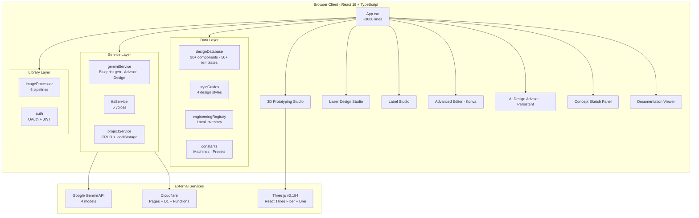

### Data Flow

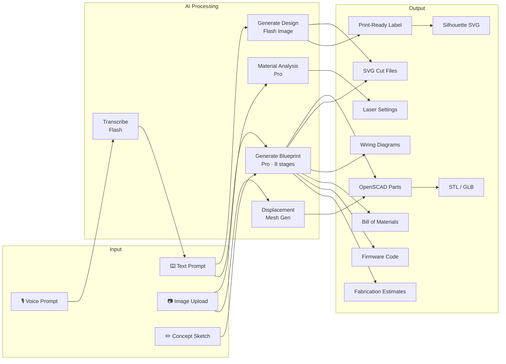

### Image Processing Pipelines

```mermaid
graph TD
    subgraph LaserPipeline["Laser Processing"]
        L1["Image Input"] --> L2["Grayscale<br/>Luma-weighted"]
        L2 --> L3["Brightness / Contrast"]
        L3 --> L4["Threshold Binarization"]
        L4 --> L5["Floyd-Steinberg Dithering"]
        L4 --> L6["Sobel Edge Detection"]
        L5 --> L7["Rotation / Flip"]
        L6 --> L7
        L7 --> L8["PNG / SVG Export"]
    end

    subgraph SilhouettePipeline["Label Silhouette"]
        S1["Design Input"] --> S2["Binary Mask"]
        S2 --> S3["Boundary Pixel Detection<br/>4-neighbor scan"]
        S3 --> S4["Angular Sort from Centroid"]
        S4 --> S5["Point Simplification"]
        S5 --> S6["SVG Path + 2px Offset"]
        S6 --> S7["Cut SVG Export"]
    end

    subgraph ExtrusionPipeline["Profile Extrusion"]
        E1["Image Input"] --> E2["Binary Mask"]
        E2 --> E3["Boundary Extraction"]
        E3 --> E4["Scale to mm"]
        E4 --> E5["OpenSCAD<br/>linear_extrude polygon"]
    end

    subgraph DisplacementPipeline["Displacement Mesh"]
        D1["Image Input"] --> D2["Brightness → Height Map<br/>Luma per pixel"]
        D2 --> D3["Subdivided Grid<br/>8–80 resolution"]
        D3 --> D4["Vertex Displacement"]
        D4 --> D5["Solid Walls + Optional Z-Mirror"]
        D5 --> D6["OpenSCAD polyhedron"]
    end
```

### Technology Stack

| Layer | Technology |
|-------|-----------|
| Framework | React 19 + TypeScript 5.8 |
| Build | Vite 6.2 |
| Styling | Tailwind CSS 4.1 (glassmorphism dark theme) |
| UI Components | shadcn/ui (Radix primitives + CVA) |
| 3D Engine | Three.js v0.184 (React Three Fiber v9.6 + Drei v10.7) |
| Canvas Editor | Konva + react-konva |
| AI | Google Gemini API (4 models — see below) |
| Auth & DB | Cloudflare Pages Functions + D1 SQLite |
| Animation | Motion (Framer Motion) |
| Icons | Lucide React |
| Notifications | Sonner (toast system) |
| Diagrams | Mermaid (wiring diagrams) |

### AI Models

| Model | Usage |
|-------|-------|
| `gemini-3.1-pro-preview` | Blueprint generation, material analysis, expert advisor (deep thinking mode) |
| `gemini-3.1-flash-image-preview` | Design generation, AI canvas synthesis (inpaint, outpaint, style transfer), label generation |
| `gemini-3-flash-preview` | Chat advisor, audio transcription, quick analysis |
| `gemini-3.1-flash-tts-preview` | Text-to-speech with 5 voice options |

---

## Supported Machines

### 3D Printers

| Printer | Type | Build Volume | Layer Height | Key Materials | Price |
|---------|------|-------------|-------------|--------------|-------|
| Elegoo Saturn 3 Ultra | MSLA Resin | 218×122×260mm | 0.01–0.2mm | Standard/ABS-Like/Castable Resin | $299 |
| Formbot T-Rex 2+ | FDM / IDEX | 400×400×500mm | 0.05–0.4mm | PLA, PETG, ABS, TPU, Nylon, PC | $799 |
| Bambu Lab P1S | FDM / CoreXY | 256×256×256mm | 0.05–0.32mm | PLA, PETG, ABS, ASA, TPU, PA, PC | $699 |
| Prusa MK4S | FDM / Bedslinger | 250×210×220mm | 0.05–0.3mm | PLA, PETG, ASA, ABS, Flex | $799 |
| Creality K1 Max | FDM / CoreXY | 300×300×300mm | 0.05–0.35mm | PLA, PETG, ABS, Nylon, TPU | $599 |

### Laser Cutters / Engravers

| Machine | Type | Work Area | Power | Key Materials | Price |
|---------|------|----------|-------|--------------|-------|
| ACMER S1 | Diode Laser | 130×130mm | 2.5W | Wood, Leather, Paper, Cork, Felt, Tin | $89 |
| xTool D1 Pro 20W | Diode Laser | 432×406mm | 20W | Wood, Acrylic, Leather, Metal (marking), Glass | $599 |
| Glowforge Pro | CO2 Laser | 495×279mm | 45W | Wood, Acrylic, Leather, Fabric, Coated Metal | $6,995 |
| OMTech 60W CO2 | CO2 Laser Cutter | 508×305mm | 60W | Wood, Acrylic, MDF, Glass, Leather, Rubber | $2,299 |
| Ortur Laser Master 3 | Diode Laser | 400×400mm | 10W | Wood, Leather, Paper, Fabric, Acrylic (dark) | $349 |

### Laser Material Presets (ACMER S1)

| Material | Power | Speed | Mode |
|----------|-------|-------|------|
| Kraft paper | 80% | 3000 mm/min | M4 |
| Plywood | 90% | 1500 mm/min | M4 |
| Solid wood | 90% | 1000 mm/min | M4 |
| Bamboo | 90% | 1000 mm/min | M4 |
| Cork | 90% | 1000 mm/min | M4 |
| Leather | 60% | 1500 mm/min | M4 |
| Silica gel | 80% | 1000 mm/min | M4 |
| Dark Felt | 60% | 1500 mm/min | M4 |
| Tin plate | 80% | 2500 mm/min | M4 |

### Label Printers

| Printer | Type | Max Width | Resolution | Max Speed | Connectivity |
|---------|------|----------|-----------|-----------|-------------|
| Munbyn ITPP130B | Direct Thermal | 108mm (4.25") | 203 DPI | 150mm/s | USB |

---

## Getting Started

### Prerequisites

- Node.js 18+
- Google Gemini API Key
- Cloudflare account with Pages and D1 (for cloud features)
- Google Cloud OAuth 2.0 Client ID (for auth)

### Installation

```bash
# Clone the repository
git clone https://github.com/danieljtrujillo/substrata-by-gantasmo.git
cd substrata-by-gantasmo

# Install dependencies
npm install

# Configure environment variables
cp .env.example .env
# Edit .env with your Gemini API key

# Start development server (frontend only)
npm run dev
```

The app runs at `http://localhost:5173`.

### Cloud Backend Setup (Optional)

```bash
# Create D1 database
npx wrangler d1 create substrata-db
# Update wrangler.toml with the database_id from the output

# Apply database schema
npm run db:migrate:local

# Start with full backend (Pages Functions + D1)
npm run dev:full
```

### Environment Variables

```env
VITE_GEMINI_API_KEY=your_gemini_api_key
```

### Cloudflare Secrets (set via dashboard or `wrangler pages secret put`)

```
GOOGLE_CLIENT_ID=your_google_oauth_client_id
GOOGLE_CLIENT_SECRET=your_google_oauth_client_secret
JWT_SECRET=a_random_secret_string_for_signing_session_tokens
```

### Commands

| Command | Description |
|---------|-------------|
| `npm run dev` | Vite dev server (frontend only) |
| `npm run dev:full` | Full dev with Wrangler (Pages Functions + D1) |
| `npm run build` | Production build |
| `npm run preview` | Preview with Wrangler |
| `npm run db:migrate` | Apply D1 schema to production |
| `npm run db:migrate:local` | Apply D1 schema to local dev |
| `npm run clean` | Remove dist/ |
| `npm run lint` | TypeScript type checking |

---

## Project Structure

```
src/
├── App.tsx                      # Main application (~3800 lines) — all views, state, advisor panel
├── main.tsx                     # React entry point
├── index.css                    # Global styles + glassmorphism dark theme
├── vite-env.d.ts                # Vite type declarations
├── constants.ts                 # Machine databases, material presets, label sizes, project templates
├── designDatabase.ts            # 30+ components, 50+ templates, DFM practices
├── engineeringRegistry.ts       # Component inventory persistence layer
├── styleGuides.ts               # 4 design style definitions (minimalist/deconstructivist/classical/organic)
├── components/
│   ├── PrototypingStudio.tsx    # Three.js/R3F prototype preview with OpenSCAD parser
│   ├── AdvancedEditor.tsx       # Konva canvas — inpaint, outpaint, style transfer
│   └── DocumentationViewer.tsx  # In-app docs with search, HTML/PDF export
├── docs/
│   └── documentationContent.ts  # Documentation section data
├── services/
│   ├── geminiService.ts         # Gemini API: blueprint gen, advisor, design, transcription, community search
│   ├── ttsService.ts            # Text-to-speech via Gemini Flash TTS (5 voices)
│   └── projectService.ts       # D1 API CRUD + localStorage fallback
└── lib/
    ├── auth.ts                  # Cloudflare OAuth + JWT session management
    └── imageProcessor.ts        # 4 pipelines: laser, silhouette, profile extrusion, displacement mesh

components/ui/                   # shadcn/ui primitives (Radix + CVA)
├── accordion.tsx, badge.tsx, button.tsx, card.tsx, dialog.tsx,
│   dropdown-menu.tsx, input.tsx, label.tsx, progress.tsx,
│   scroll-area.tsx, select.tsx, separator.tsx, slider.tsx,
│   sonner.tsx, tabs.tsx

functions/                       # Cloudflare Pages Functions (API backend)
├── jwt.ts                       # JWT sign/verify + cookie helpers
├── types.ts                     # Shared TypeScript types
└── api/
    ├── auth/
    │   ├── login.ts             # Redirect to Google OAuth
    │   ├── callback.ts          # Exchange code → set JWT cookie
    │   ├── logout.ts            # Clear session
    │   └── me.ts                # Get current user from JWT
    └── projects/
        ├── _middleware.ts       # Auth verification middleware
        ├── index.ts             # GET (list) / POST (create)
        └── [id].ts              # PUT (update) / DELETE

public/docs/screenshots/         # App screenshots for documentation
```

---

## UI Layout

```
┌─────────────────────────────────────────────────────────────────────┐
│  SUBSTRATA by GANTASMO   │ 3D│Laser│Labels │ Styles │ Lib│Reg│...  │
├──────────┬──────────────────────────────────────────────┬───────────┤
│          │  3D Viewport │ BOM │ Design Files │ Code │ Assembly     │
│  Design  │  ~polygons  ~print time  ~cut time  [Export]│  Machine  │
│  Advisor ├─────────────────────────────────────────────┤  Settings │
│          │                                             │           │
│  Chat    │            Three.js Viewport                │  Printer  │
│  history │               or                            │  selector │
│          │         Full-viewport overlay                │           │
│  Voice   │          (BOM / Files / Code / Assembly)     │  Build    │
│  input   │                                             │  volume   │
│          │  ┌─────────────────────────────────────┐    │           │
│  Deep    │  │ Layers│Settings│Printer│Ref│Sketch│ │    │  Design   │
│  Think   │  │ Extrude│Displace│STL│GLB│AR       │ │    │  notes    │
│          │  └─────────────────────────────────────┘    │           │
│  Build   │                                             │  GANTASMO │
│  Blueprint│                                            │  analysis │
├──────────┴──────────────────────────────────────────────┴───────────┤
```

---

## Security

- **Authentication** — Google OAuth 2.0 via Cloudflare Pages Functions
- **Sessions** — JWT in HttpOnly Secure SameSite=Lax cookies (7-day expiry)
- **Authorization** — All project data scoped to authenticated user; API middleware verifies ownership on every mutation
- **SQL injection** — Prevented via D1 parameterized bindings (no string concatenation)
- **Secrets** — OAuth credentials and JWT secret stored as Cloudflare Pages secrets; API keys injected at build time via Vite, never committed to source
- **XSS** — React's default escaping; no `dangerouslySetInnerHTML` on user content
- See [security_spec.md](security_spec.md) for detailed security analysis

---

## Documentation

Full documentation is available in three ways:

1. **In-app** — Click the **Docs** button in the navigation bar
2. **HTML export** — Download an interactive offline reference
3. **PDF export** — Generate a print-ready document

Documentation covers: Overview, Prototyping Pipeline, Design Guides and Best Practices, Feature Reference, API Reference, Community Sources, Security, and Setup.

---

## Feature Count Summary

| Category | Count |
|----------|-------|
| Engineering Modes | 3 (3D Prototyping, Laser, Labels) |
| Design Styles | 4 (minimalist, deconstructivist, classical, organic) |
| Image Processing Filters | 9 (brightness, contrast, threshold, dither, invert, edge detect, rotate, flip H/V) |
| Sketch Modes | 4 (rough, refined, technical, presentation) |
| Blueprint Generation Stages | 8 |
| Project Templates | 50+ |
| Laser Material Presets | 9 |
| 3D Printers in Database | 5 |
| Laser Cutters in Database | 5 |
| Label Size Presets | 8 |
| Real Components in DB | 30+ |
| Export Formats | 6 (PNG, SVG, STL, GLB, PDF, HTML) |
| AI Models | 4 |
| Community Sources | 7 (GitHub, Thingiverse, Instructables, Hackaday, GrabCAD, Printables, MyMiniFactory) |
| TTS Voices | 5 (Kore, Charon, Puck, Aoede, Leda) |
| Image Synthesis Modes | 3 (inpaint, outpaint, style transfer) |
| 2D→3D Methods | 2 (profile extrusion, displacement mesh) |

---

## License

SPDX-License-Identifier: Apache-2.0
